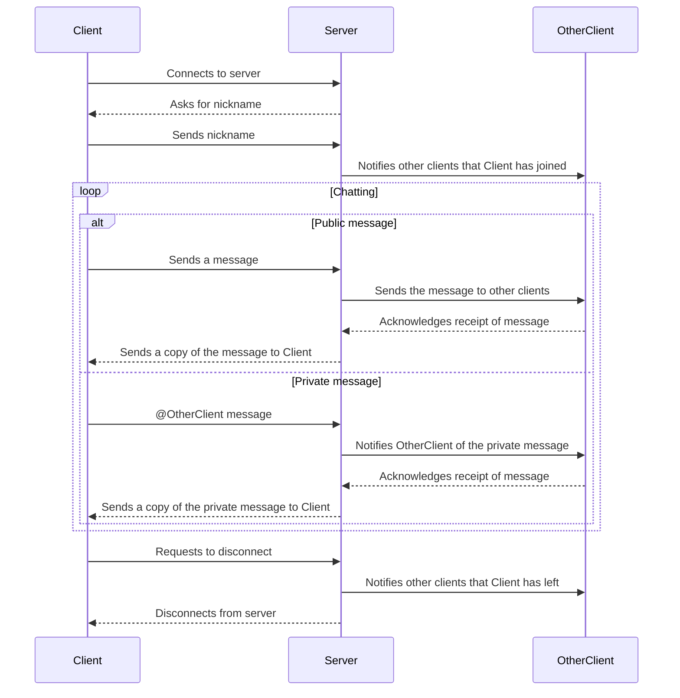

# Multi-user chat server

The system is a Python-based distributed chat application consisting of two main components: a client and a server. The client and server will communicate with each other over the internet using the Transmission Control Protocol (TCP).

The server will be responsible for managing the chat room and routing messages between clients. When a client connects to the server, it will be asked to provide a nickname, which will be used to identify the client in the chat room. The server will keep track of all connected clients and their nicknames in a dictionary.

The server will have two main functions: handling client connections and broadcasting messages to all connected clients. When a client connects to the server, a new thread will be created to handle that client's connection. The thread will listen for incoming messages from the client and route them to the appropriate recipients (either all connected clients or a specific client in the case of private messages).

The client will be responsible for displaying the chat room interface to the user and sending messages to the server. When a user opens the chat room, the client will connect to the server and provide a nickname. The client will then be able to send messages to the server, which will be broadcast to all connected clients or sent as a private message to a specific client.

- Two types of transparency have been implemented in the chat system: location transparency and access transparency. Location transparency means clients don't need to know the physical location of other clients to communicate with them, achieved by the server routing messages between clients. Access transparency means clients only need to know the interface provided by the server, which is connecting to the server and sending messages.
- The system has used a server-client architecture to achieve scalability, allowing the server to handle multiple client connections simultaneously. To handle the load of many clients sending messages at once, threading has been used in the implementation.
- The chat system handles failures gracefully by removing clients from the list of active clients and notifying remaining clients if a client disconnects unexpectedly. If the server fails, the system will stop working, but redundancy could be added by implementing multiple servers.

## Diagram

## Video

[video.webm](https://user-images.githubusercontent.com/68151686/229355908-9a9165a2-d4f9-43a1-83b6-b1c73260fe24.webm)

## Functionality

- Client connects to the server and provides a nickname.
- Server receives the nickname from the client and adds the client to the list of connected clients.
- Client sends a message to the server.
- Server receives the message from the client and routes it to the appropriate recipients (either all connected clients or a specific client in the case of private messages).
- Server broadcasts the message to all connected clients.
- Client receives the message from the server and displays it in the chat room interface.
- Client sends a private message to a specific client by typing `@<nickname> <message>`.
- Server routes the private message to the intended recipient.
- Intended recipient receives the private message from the server and displays it in their chat room interface.
- Client disconnects from the server using the `\q` command.

## Starting the chat room

Start the server by running the `server.py` script:

    $ python server.py

After the server has started, start the client by running the `client.py` script:

    $ python client.py

Multiple clients can be started by running the `client.py` script in multiple terminal windows.
